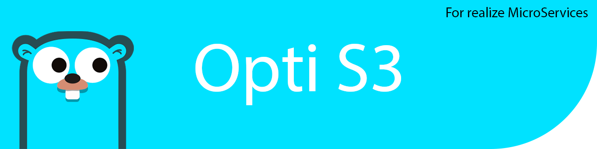

<strong>Project Design Principles</strong>

  

  
  ## Project Design Principles
  #### SOLID is an acronym for the five principles of object-oriented programming. These principles help create code that is clear, flexible, and easy to maintain.
  * 
  * 
  * 
  * 
  * 
  
  ### Folders:
  * `config` → **Configuration**  
    Application configuration (env variables, YAML, settings)
  
  * `handlers` → **HTTP Handlers / Controllers**  
    Entry points for incoming requests (API layer)
  
  * `interfaces` → **Interfaces / Contracts**  
    Contracts for core components (e.g., Storage, ImageProcessor)
  
  * `middleware` → **Middleware**  
    Request/response interceptors (auth, logging, rate limiting)
  
  * `models` → **Domain Models**  
    Internal data structures (e.g., Image, User)
  
  * `providers` → **Providers / Integrations**  
    External implementations (e.g., S3, local storage, image processing)
  
  * `services` → **Business Logic / Services**  
    Core application logic (facade + use cases)
  
  * `utils` → **Utilities / Helpers**  
    Helper functions (files, errors, small utilities)
  
    ### Relationships
    `handlers` → `services` → `interfaces` ← `providers`
    

